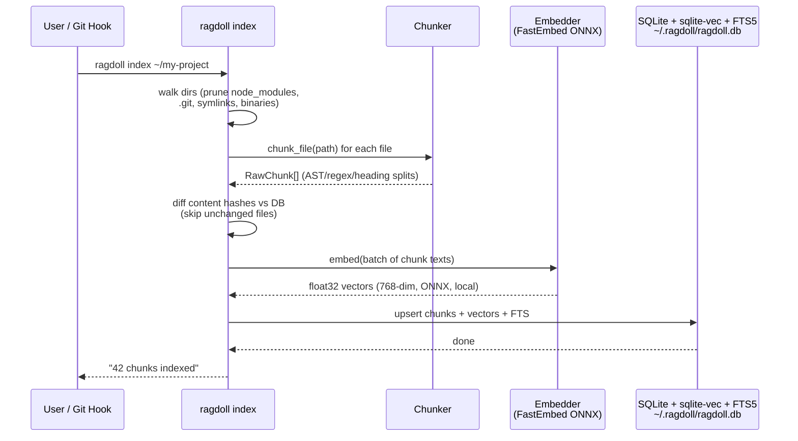
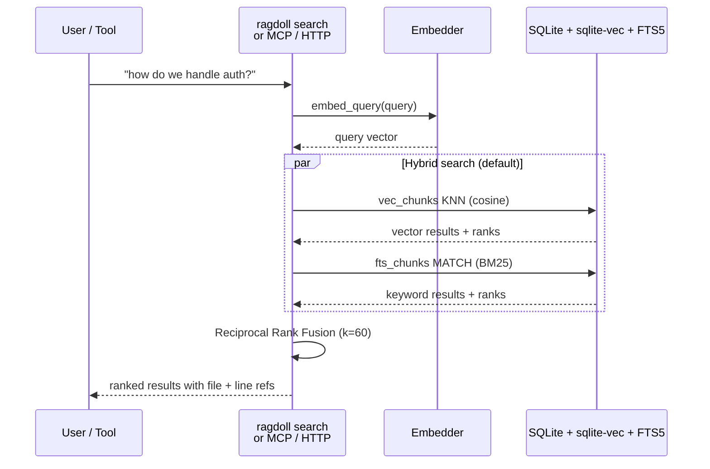
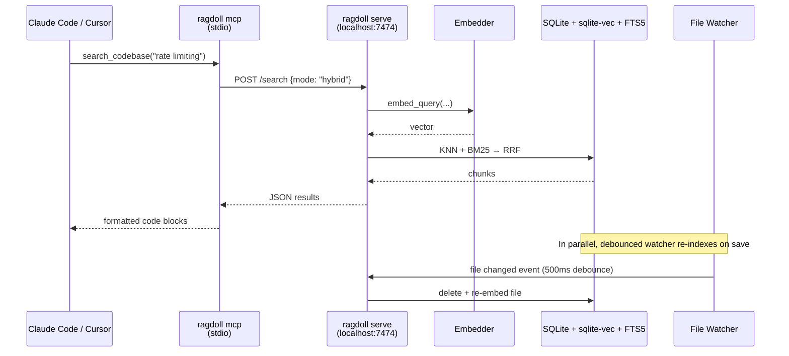

<p align="center">
  
  <br>
  <sub>pixel art inspired by Dangerous Dave + Raggedy Ann</sub>
</p>

<h1 align="center">RAGdoll</h1>

<p align="center">
  <strong>Search all your projects at once. Remember decisions that don't belong in code. Pipe context to any LLM.</strong>
</p>

<p align="center">
  Local only &middot; No cloud &middot; No daemon required &middot; MIT
</p>

---

- [Why RAGdoll?](#why-ragdoll)
- [How it works](#how-it-works)
- [Install](#install)
- [Usage](#usage)
- [Claude Code integration (MCP)](#claude-code-integration-mcp)
- [Cursor integration](#cursor-integration)
- [OpenAI-compatible embeddings endpoint](#openai-compatible-embeddings-endpoint)
- [Multiple profiles](#multiple-profiles)
- [Always-on daemon](#always-on-daemon-macos)
- [Troubleshooting](#troubleshooting)
- [Stack](#stack)
- [Deep dive](#deep-dive)

---

### Why RAGdoll?

Your AI tools already read code, but only the repo you're in, only this session, and they forget everything when you close the tab.

**RAGdoll fixes three problems:**

| Problem | What RAGdoll does |
|---|---|
| **Claude/Cursor only see one repo** | RAGdoll indexes all your projects into one searchable store. Ask "how did I handle auth in the Go service?" while working in the Python one. |
| **Decisions live in Slack threads and your head** | `ragdoll remember "we use JWT not sessions, mobile can't do cookies"` stores it as a first-class searchable result, right alongside code. |
| **Context dies when sessions end** | RAGdoll's index is a persistent SQLite file. Onboard a new teammate by sharing `~/.ragdoll/ragdoll.db`. Pack context for any LLM with `ragdoll context "auth flow" \| pbcopy`. |

Works with **Claude Code**, **Cursor**, **Copilot**, **Continue.dev**, or anything that speaks HTTP/MCP. Index once, search from everywhere.

---

## How it works

### Indexing flow



### Search flow



### Live daemon flow (optional, for MCP integration)



### Architecture overview

```
┌──────────────────────────────────────────────────────────┐
│                     Your machine                          │
│                                                           │
│  ┌──────────────┐   ┌──────────────────────────────┐    │
│  │  Dev tools   │   │      ragdoll daemon           │    │
│  │              │   │   (optional, port 7474)       │    │
│  │ Claude Code ─┼───┤► MCP stdio adapter            │    │
│  │ Cursor      ─┼───┘  FastAPI HTTP server          │    │
│  │ Copilot     ─┼─────► POST /v1/embeddings         │    │
│  │ Continue.dev─┼─────► POST /search                │    │
│  └──────────────┘   └────────────┬─────────────────┘    │
│                                   │                       │
│  ┌────────────────────────────────▼──────────────────┐   │
│  │              ragdoll CLI (no daemon needed)        │   │
│  │                                                    │   │
│  │  ragdoll index   →  Chunker + Embedder             │   │
│  │  ragdoll search  →  Embedder + VectorStore         │   │
│  │  ragdoll context →  Search + token-budgeted pack   │   │
│  │  ragdoll hooks   →  git post-checkout/merge        │   │
│  └────────────────────────────────┬──────────────────┘   │
│                                   │                       │
│  ┌────────────────────────────────▼──────────────────┐   │
│  │         ~/.ragdoll/ragdoll.db                      │   │
│  │                                                    │   │
│  │  chunks      — content, path, repo, lang, hash     │   │
│  │  vec_chunks  — sqlite-vec 768-dim float32 vectors  │   │
│  │  fts_chunks  — FTS5 BM25 index over content        │   │
│  └────────────────────────────────────────────────────┘   │
└──────────────────────────────────────────────────────────┘
```

---

## Install

```bash
git clone https://github.com/hriprsd/ragdoll
cd ragdoll
./scripts/install.sh           # interactive
./scripts/install.sh --yes     # non-interactive (CI / scripted)
```

The installer will:
- Verify Python 3.11+ and `sqlite3`
- Create a virtualenv at `~/.ragdoll/venv/`
- Install RAGdoll with **FastEmbed** (ONNX, no PyTorch, ~50 MB of deps)
- Install a `ragdoll` wrapper binary (no venv activation needed)
  - Apple Silicon: prefers `/opt/homebrew/bin`
  - Intel Mac / Linux: prefers `/usr/local/bin`, then `~/.local/bin`, then `~/bin`
- Optionally add it to your `PATH` (bracketed with `# >>> ragdoll install` markers so uninstall removes exactly what was added)
- Optionally **prefetch the embedding model** (~200 MB) so first search isn't a multi-minute surprise
- Optionally install git hooks into your current repo

### First-run expectations

- The embedding model (`nomic-embed-text-v1.5`, ONNX, ~200 MB) is fetched from Hugging Face on first use unless you opted into the prefetch step. It is cached at `~/.cache/fastembed/` and never re-downloaded.
- After that, **nothing leaves your machine**. Indexing, embedding, and search are all local.
- Disk budget: plan for ~500 MB on first install (deps + model). The DB itself grows roughly linearly with the number of chunks (~3-5 KB/chunk).

### Uninstall

```bash
./scripts/uninstall.sh             # interactive
./scripts/uninstall.sh --yes       # non-interactive (keeps DB by default)
./scripts/uninstall.sh --keep-db   # never prompt to delete the index DB
```

The uninstaller will:
- Stop and remove the launchd agent (if `ragdoll autostart install` was ever run)
- Walk `~/.ragdoll/hook_registry` and clean RAGdoll blocks from every repo's `.git/hooks/post-checkout` + `post-merge` (preserving any user content in those files)
- Remove the wrapper binary, venv, log directory, and bookkeeping files
- Optionally delete the index DB (default: keep)
- Strip the `# >>> ragdoll install` block from your shell rc

---

## Usage

### Index a project

```bash
ragdoll index ~/my-project
```

Shows a progress bar for directories. Skips unchanged files via content hashing, and
**embeds each unique chunk only once per run** — identical boilerplate repeated across files
(license headers, shared templates, vendored snippets) reuses one vector instead of
re-embedding every copy. On completion it reports the split, e.g.
`Done — 812 chunks written (640 embedded, 172 reused)`, so a resume of a partial index no
longer looks like a full rebuild.

#### Faster / cooler indexing on big repos

The first full index of a large repo is CPU-heavy (it embeds everything once). Levers:

```bash
ragdoll --quantized index ~/my-project     # int8 nomic (768-dim): ~2× faster on CPU, tiny recall cost
ragdoll --fast index ~/my-project          # bge-small (384-dim): ~3× faster, slightly weaker recall
ragdoll index ~/my-project --throttle 150  # sleep 150ms between batches — cooler, responsive, slower
```

`--quantized` and `--fast` each use their own DB (`~/.ragdoll/ragdoll-quant.db`,
`~/.ragdoll/ragdoll-fast.db`) so different-model vectors never mix. `--throttle` is also settable
via `RAGDOLL_THROTTLE_MS`. On macOS, `taskpolicy -b ragdoll index …` runs it at background
priority (efficiency cores) so your machine stays responsive.

**Model choice is sticky — you don't have to remember it.**

- An **existing index always uses the model it was built with.** Point any command at a DB and RAGdoll
  reads the recorded model from it — no flag needed. A flag that *contradicts* what the index was built
  with is a hard error (it would silently mix incompatible vectors); run `ragdoll reindex` to switch.
- The **last model flag you pass is remembered** as your default (in `~/.ragdoll/config.json`), so bare
  `ragdoll index` / `ragdoll search` reuse it. Pass `--fast`/`--quantized`/`--standard` any time to
  change it; `--standard` returns to the default nomic model.

Once a repo is indexed, keep it fresh incrementally with the [daemon watcher](#run-the-server-daemon)
instead of re-running big batches.

### Search

RAGdoll uses **hybrid search by default**: BM25 keyword matching (FTS5) combined with vector similarity via Reciprocal Rank Fusion. See [docs/how-it-works.md](docs/how-it-works.md) for a full explanation.

```bash
ragdoll search "how do we handle rate limiting"          # hybrid (default)
ragdoll search "handleRateLimit" --mode bm25             # exact identifier
ragdoll search "auth flow" --mode vector                 # conceptual/semantic
ragdoll search "JWT" --top-k 5 --repo ~/my-project      # filtered
ragdoll search "connection pool" --no-memories           # exclude memory notes
```

### Remember things (explicit memory notes)

Store decisions, architecture notes, or anything you want searchable alongside your code:

```bash
ragdoll remember "we use JWT not sessions, mobile client can't do cookies"
ragdoll remember "payments service owns its DB, never query it directly" --tags arch,payments
ragdoll memories          # list all stored notes
ragdoll forget <id>       # remove a note by its ID
```

### Pack context for any LLM

Get a ready-to-paste context block within a token budget. Pipe it anywhere:

```bash
ragdoll context "auth flow" --tokens 4000 | pbcopy
ragdoll context "rate limiting" --tokens 8000 --repo ~/my-project > ctx.txt
```

### Run the server (daemon)

Most commands work without a daemon. Start one when you want MCP integration, live file-watching, the OpenAI-compatible embeddings endpoint, or simply a **warm model** so searches skip the ~500 MB cold load:

```bash
ragdoll serve                          # http://localhost:7474
ragdoll serve --watch ~/my-project     # also re-index on save (debounced)
ragdoll serve --port 8080              # custom port
```

While it's running, `ragdoll search`, `ragdoll context`, and MCP calls **auto-route to it** — reusing the already-loaded model instead of spawning a second one in RAM. The CLI only trusts the daemon when it serves the same DB you'd query locally, so `--db` / `--fast` still hit the right index; if no compatible daemon is listening it falls back to a local load.

**Stop it:** press `Ctrl+C` in its terminal, or from anywhere:

```bash
ragdoll stop                   # graceful SIGTERM on the daemon port
ragdoll stop --port 8080       # honors a custom port ($RAGDOLL_PORT too)
ragdoll stop --force           # SIGKILL immediately
```

`stop` finds the process listening on the daemon port and terminates it (falling back to SIGKILL if it doesn't exit within ~5s). For a login-persistent launchd daemon, use `ragdoll autostart uninstall` instead.

### See what's indexed

```bash
ragdoll list              # repos with chunk counts + last indexed time
ragdoll stats             # breakdown by repo and language
ragdoll status            # DB size, repo count, model info
```

### Remove from the index

```bash
ragdoll forget ~/old-project          # remove a whole directory
ragdoll forget ~/old-project/file.py  # remove one file
ragdoll forget abc123def456           # remove a memory note by ID
```

### Per-project exclusions (`.ragdollignore`)

Drop a `.ragdollignore` in any directory (same syntax as `.gitignore`):

```
# .ragdollignore
tests/fixtures/
*.generated.ts
vendor/
migrations/
```

RAGdoll walks up from each file to find the nearest `.ragdollignore` and applies it automatically.

### Auto-index via git hooks

```bash
ragdoll hooks install     # post-checkout + post-merge in current repo
ragdoll hooks uninstall
```

Existing non-RAGdoll hooks are preserved. RAGdoll appends, never overwrites.

---

## Claude Code integration (MCP)

Add to `~/.claude/settings.json`:

```json
{
  "mcpServers": {
    "ragdoll": {
      "command": "ragdoll",
      "args": ["mcp"]
    }
  }
}
```

Claude Code will now have a `search_codebase` tool available in every session.

> **Note:** For live file-watching (index on save), also run `ragdoll serve --watch ~/my-project`.

---

## Cursor integration

Add to `.cursor/mcp.json` in your project:

```json
{
  "mcpServers": {
    "ragdoll": {
      "command": "ragdoll",
      "args": ["mcp"]
    }
  }
}
```

---

## OpenAI-compatible embeddings endpoint

RAGdoll can serve as a **drop-in local embedding provider** for anything that speaks the OpenAI embeddings API: Continue.dev, LangChain, LlamaIndex, Copilot extensions, custom scripts. Your text never leaves the machine.

```bash
ragdoll serve        # starts daemon on http://localhost:7474
```

```bash
# Works with any OpenAI SDK:
curl -s http://localhost:7474/v1/embeddings \
     -H "Content-Type: application/json" \
     -d '{"input": "how does auth work", "model": "ragdoll"}'
```

Example response:
```json
{
  "object": "list",
  "data": [{"object": "embedding", "index": 0, "embedding": [0.012, -0.043, ...]}],
  "model": "ragdoll",
  "usage": {"prompt_tokens": 0, "total_tokens": 0}
}
```

**Continue.dev** `config.json`:
```json
"embeddingsProvider": {
  "provider": "openai",
  "model": "ragdoll",
  "apiBase": "http://localhost:7474/v1"
}
```

**LangChain / LlamaIndex**: point `OpenAIEmbeddings(base_url="http://localhost:7474/v1", api_key="ignored")`. No API key required, the server is local-only.

---

## Multiple profiles

Keep separate indexes for different workspaces by setting `RAGDOLL_DB`:

```bash
RAGDOLL_DB=~/.ragdoll/work.db ragdoll index ~/repos/work
RAGDOLL_DB=~/.ragdoll/side.db ragdoll index ~/repos/side-project
```

All commands honour the variable, so you can set it per-shell or per-project.

---

## Debug queries with `ragdoll explain`

Want to know why a result ranked where it did?

```bash
ragdoll explain "jwt validation"
```

Shows the per-result `vec_rank`, `bm25_rank`, and final `rrf` score. Useful for tuning queries or catching FTS misses.

---

## Backup and share indexes

```bash
ragdoll export index.jsonl          # dump everything (content + vectors)
ragdoll import index.jsonl --replace  # seed a fresh install
```

Handy for backups or onboarding a teammate without re-indexing from scratch.

---

## Always-on daemon (macOS)

Tired of restarting `ragdoll serve`? Install a launchd agent:

```bash
ragdoll autostart install --watch ~/repos/work --watch ~/repos/side
```

The daemon now starts at login, survives reboots, and logs to `~/.ragdoll/ragdoll.log`. Uninstall with `ragdoll autostart uninstall`.

---

## Diagnose problems

```bash
ragdoll doctor
```

Checks the DB, FTS schema, embedding model, daemon port, and launchd agent. One-stop triage for a broken install.

---

## How it works

RAGdoll uses a **three-layer search stack**: embeddings, BM25, and hybrid fusion.

- **Embeddings** turn your code into 768-dimensional vectors capturing semantic meaning
- **FTS5 BM25** provides exact keyword matching for identifiers, error strings, and function names
- **Reciprocal Rank Fusion** combines both signals: a result appearing in both lists floats to the top

Full explanation with diagrams: [docs/how-it-works.md](docs/how-it-works.md)

## Stack

| Component | Choice | Why |
|---|---|---|
| Vector store | SQLite + sqlite-vec | Single file, no server, inspectable with `sqlite3` |
| Keyword search | SQLite FTS5 (built-in) | BM25 for exact identifiers, zero extra deps |
| Search fusion | Reciprocal Rank Fusion | Best of both: semantic + exact |
| Embeddings | nomic-embed-text-v1.5 via **FastEmbed** | 768-dim, ONNX Runtime (CUDA when available, CPU otherwise), no PyTorch, no API key |
| Code chunking | AST (Python), regex (TS/JS, Go), heading (Markdown), fallback (line-window) | Smarter splits, better recall |
| CLI | typer + rich | Clean UX with progress bars |
| Daemon (optional) | FastAPI + uvicorn | Thin, async, OpenAI-compatible endpoint |

---

## What gets skipped

RAGdoll will never index:

| Category | Examples |
|---|---|
| **Secrets** | `.env`, `*.pem`, `*.key`, `id_rsa`, `credentials.json`, `*.keystore` |
| **Directories** | `node_modules/`, `.git/`, `__pycache__/`, `dist/`, `build/`, `.venv/` |
| **Generated** | `*.lock`, `*.min.js`, `*.min.css`, `*.map`, `*.bundle.js` |
| **Binary** | `*.wasm`, `*.so`, `*.exe`, `*.dll`, plus null-byte detection on unknown files |
| **Data** | `*.sqlite`, `*.parquet`, `*.pkl`, `*.pickle` |
| **Media** | `*.png`, `*.jpg`, `*.mp4`, `*.woff2`, `*.svg` |
| **Archives** | `*.zip`, `*.tar`, `*.gz`, `*.7z` |
| **Large files** | Anything over 1 MB (likely generated/vendored) |
| **Symlinks** | Always skipped. Prevents infinite loops and duplicate indexing |
| **Hidden files** | Dotfiles except `.md`, `.mdx`, `.toml`, `.rst` |

Plus per-project overrides via `.ragdollignore`.

---

## Performance and memory

RAGdoll is designed to run on developer laptops (8-32 GB RAM) without choking your machine.

### Hardware acceleration

| Platform | Provider | Notes |
|---|---|---|
| macOS (Apple Silicon) | CPU | CoreML is intentionally skipped -- embedding models use dynamic shapes that force split execution, doubling memory |
| Linux/Windows + NVIDIA | CUDA | Auto-detected when available |
| Everything else | CPU | Thread-capped, always works |

### Memory safeguards

| Feature | What it does |
|---|---|
| **Adaptive batch size** | Detects system RAM and picks batch size accordingly: 16 (<=8 GB), 32 (8-16 GB), 64 (16-32 GB), 128 (32+ GB). Override with `RAGDOLL_BATCH_SIZE=N` |
| **Thread cap** | ONNX threads capped at half your CPU cores (min 2), preventing thrash when multiple processes run. Override with `RAGDOLL_THREADS=N` |
| **Single-inference lock** | File lock at `~/.ragdoll/.index.lock` ensures only one ragdoll process runs ONNX inference at a time — now covering **search and context**, not just index. A second process prints a one-line notice, waits up to `RAGDOLL_LOCK_TIMEOUT` seconds (default 120), then **fails fast** with a clear message instead of blocking silently or loading a second ~500 MB model |
| **Warm daemon reuse** | When `ragdoll serve` is running, `ragdoll search` / `ragdoll context` route to its already-loaded model over HTTP, skipping the cold load entirely (and never holding two models in RAM) |
| **Model unload** | ONNX model and C-level buffers are explicitly released after indexing completes, instead of holding memory until process exit |

Run `ragdoll status` to see your detected configuration (accelerator, threads, batch size).

---

## Troubleshooting

Run `ragdoll doctor` first. It covers DB readability, FTS schema version, embedding model loadability, daemon port, launchd agent status, free disk space, embedding-dim mismatch, partial indexes (files with incomplete chunks), **unindexed files** (whole files on disk missing from the index, e.g. from a killed run), and deleted files.

| Symptom | Likely cause | Fix |
|---|---|---|
| `ragdoll search` blocks for minutes on first run | Model download (~200 MB) from Hugging Face | One-time. Or prefetch with `python -c "from ragdoll.embedder import Embedder; Embedder()._load_model()"` |
| Watcher sees no events for files in `~/Documents` / `~/Desktop` / iCloud Drive | macOS Full Disk Access not granted | System Settings → Privacy & Security → Full Disk Access → add Terminal (and `ragdoll` if running via launchd) |
| `OSError: [Errno 48] Address already in use` on `ragdoll serve` | Port 7474 taken | `ragdoll serve --port 7475` or kill the other process |
| Search returns junk after switching machines | Embedding-model mismatch, DB was indexed with a different model | `ragdoll reindex` |
| `ragdoll status` shows model mismatch warning | First run after upgrading the embedder | `ragdoll reindex` |
| launchd agent doesn't start after reboot | Bad PATH or stale binary path baked in | `ragdoll autostart uninstall && ragdoll autostart install --watch <dir>` |
| Pip install fails on `fastembed` / `onnxruntime` | Old pip or unsupported arch | Inside the venv: `pip install --upgrade pip`, then re-run `install.sh` |
| Hugging Face download fails behind corporate proxy | TLS interception or blocked CDN | Set `HF_HUB_OFFLINE=1` and pre-stage the model files under `~/.cache/fastembed/` |
| `ragdoll doctor` reports FTS schema mismatch | Upgraded RAGdoll across an FTS schema bump | Open the DB once with any RAGdoll command, auto-migration runs on connect |
| Want a clean rebuild | Index drifted from disk after a long sleep or mass file moves | `ragdoll reindex` |
| `ragdoll doctor` reports partial indexes | Index process was killed mid-run (OOM, Ctrl+C, laptop sleep) | `ragdoll index <repo>` -- re-indexing auto-repairs incomplete files |
| `ragdoll doctor` reports deleted files | Indexed files were moved or deleted from disk | `ragdoll forget <path>` to clean up, or reindex the repo |
| Search returns irrelevant results for exact values | Exact terms (port numbers, IDs) need keyword match, but the file may not be indexed | Run `ragdoll doctor` to check for partial indexes, then reindex |

### Backup

Just copy the DB file:
```bash
cp ~/.ragdoll/ragdoll.db ~/Backups/ragdoll-$(date +%F).db
```

For cross-machine seeding (or sharing with a teammate on the same model), use `ragdoll export` / `ragdoll import`. Import refuses on dimension mismatch so you can't silently corrupt search quality.

### Security note

The HTTP daemon binds to `127.0.0.1` only and has no authentication. Treat it as trusted-local-only. On a shared machine, prefer the direct CLI (no daemon) and skip `ragdoll serve` / `ragdoll autostart install`.

---

## Project layout

```
ragdoll/
├── ragdoll/
│   ├── __init__.py     ← package version
│   ├── cli.py          ← entry point (index / search / serve / mcp / hooks / autostart / doctor)
│   ├── api.py          ← FastAPI daemon (optional, tool-agnostic HTTP)
│   ├── mcp_server.py   ← MCP stdio adapter (Claude Code + Cursor)
│   ├── indexer.py      ← per-chunk incremental, content-anchored vector reuse, process lock, adaptive batching
│   ├── chunker.py      ← AST / regex / heading-based splitting
│   ├── embedder.py     ← FastEmbed ONNX wrapper, lazy load, LRU query cache, auto provider detection, model unload
│   ├── store.py        ← SQLite + sqlite-vec + FTS5, model tracking, dedup
│   ├── search.py       ← pure utilities: vector packing, FTS query, RRF
│   └── watcher.py      ← debounced filesystem event handler (daemon only)
├── tests/
│   ├── fixtures/       ← multi-language test corpus (Py, Go, TS, Markdown, YAML)
│   ├── test_chunker.py
│   ├── test_store.py
│   └── test_integration.py  ← pipeline + HTTP API + incremental + cache
├── scripts/
│   ├── install.sh      ← bash 3.2 compatible, supports --yes / non-TTY
│   └── uninstall.sh    ← cleans launchd, hook registry, PATH markers, DB
├── docs/
│   └── how-it-works.md
├── LICENSE             ← MIT
├── CLAUDE.md           ← project instructions for Claude Code
└── pyproject.toml      ← single source of truth for deps
```

---

## Deep dive

I wrote a three-part series on Medium about the thinking and tradeoffs behind RAGdoll:

1. **[I Built a Local RAG Engine Because My AI Tools Keep Forgetting Everything](https://medium.com/@hriprsd/i-built-a-local-rag-engine-because-my-ai-tools-keep-forgetting-everything-6f6a550817d5)** - what it does, why it exists, and how it fits alongside tools like Cursor/Claude/Copilot
2. **[Building RAGdoll Part 2: ONNX, Hybrid Search, and Why I Skipped PyTorch](https://medium.com/@hriprsd/building-ragdoll-part-2-onnx-hybrid-search-and-why-i-skipped-pytorch-f33e967f0912)** - ONNX vs PyTorch, how the embedding pipeline works, hybrid search internals, and lessons learned
3. **[Building RAGdoll Part 3: What Happened When I Indexed a 10,000-File Repo](https://medium.com/@hriprsd/building-ragdoll-part-3-what-happened-when-i-indexed-a-10-000-file-repo-436d35bcdd1e)** - the CoreML meltdown, global chunk dedup, honest index reporting, and keeping a big index cool on a laptop

---

## License

MIT
