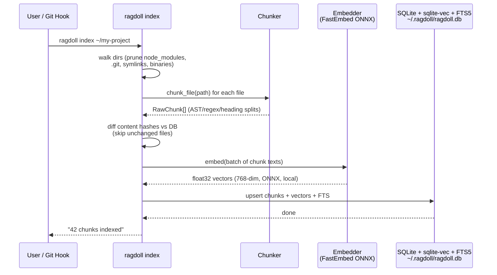
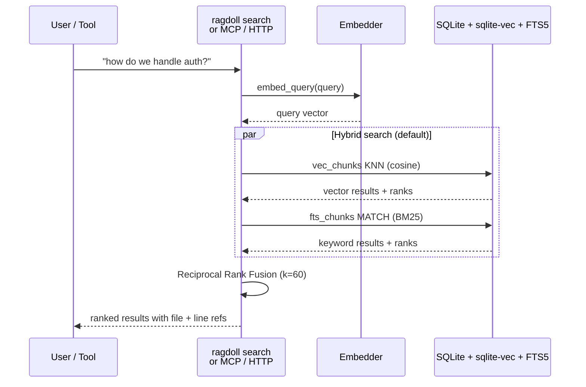
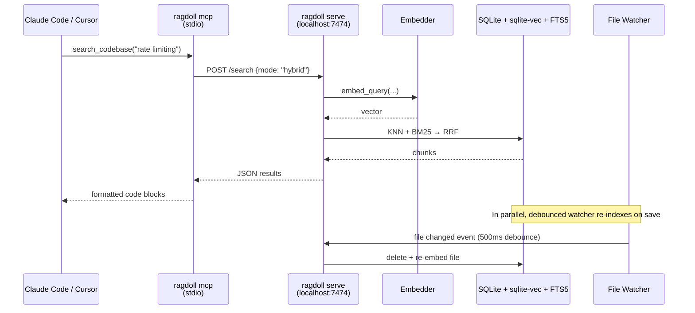

# RAGdoll architecture and data flows

A visual walkthrough of how `ragdoll index`, `ragdoll search`, and the optional
daemon move data around. For the conceptual deep dive (what an embedding is, BM25
via FTS5, Reciprocal Rank Fusion, storage layout), see [how-it-works.md](how-it-works.md).

## Indexing flow



## Search flow



## Live daemon flow (optional, for MCP integration)



## Architecture overview

```
┌──────────────────────────────────────────────────────────┐
│                     Your machine                          │
│                                                           │
│  ┌──────────────┐   ┌──────────────────────────────┐    │
│  │  Dev tools   │   │      ragdoll daemon           │    │
│  │              │   │   (optional, port 7474)       │    │
│  │ Claude Code ─┼───┤► MCP stdio adapter            │    │
│  │ Cursor      ─┼───┘  FastAPI HTTP server          │    │
│  │ Copilot     ─┼─────► POST /v1/embeddings         │    │
│  │ Continue.dev─┼─────► POST /search                │    │
│  └──────────────┘   └────────────┬─────────────────┘    │
│                                   │                       │
│  ┌────────────────────────────────▼──────────────────┐   │
│  │              ragdoll CLI (no daemon needed)        │   │
│  │                                                    │   │
│  │  ragdoll index   →  Chunker + Embedder             │   │
│  │  ragdoll search  →  Embedder + VectorStore         │   │
│  │  ragdoll context →  Search + token-budgeted pack   │   │
│  │  ragdoll hooks   →  git post-checkout/merge        │   │
│  └────────────────────────────────┬──────────────────┘   │
│                                   │                       │
│  ┌────────────────────────────────▼──────────────────┐   │
│  │         ~/.ragdoll/ragdoll.db                      │   │
│  │                                                    │   │
│  │  chunks      - content, path, repo, lang, hash     │   │
│  │  vec_chunks  - sqlite-vec 768-dim float32 vectors  │   │
│  │  fts_chunks  - FTS5 BM25 index over content        │   │
│  └────────────────────────────────────────────────────┘   │
└──────────────────────────────────────────────────────────┘
```
