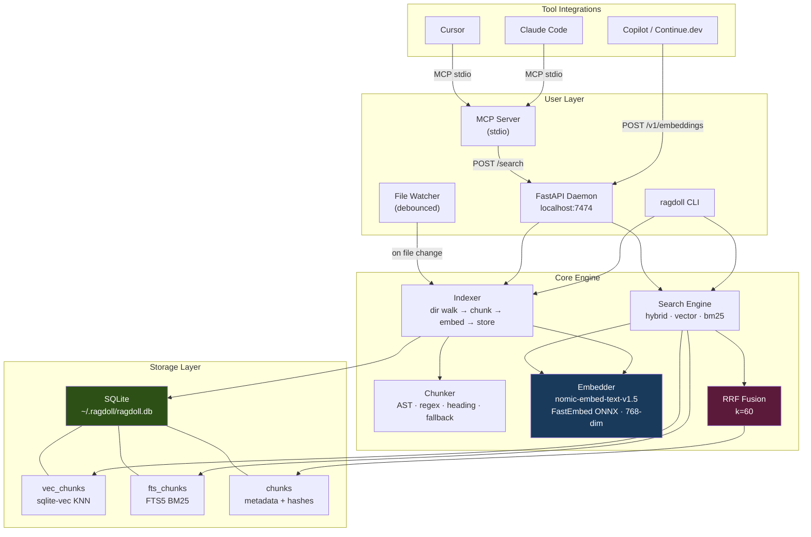

# How RAGdoll works - embeddings, FTS5, and hybrid search

This document explains the three-layer search stack inside RAGdoll and why each piece exists.

## Architecture



---

## 1. What an embedding actually does to your code

When RAGdoll indexes a file, each chunk of code or text goes through an **embedding model** - specifically `nomic-embed-text-v1.5`, a 768-dimensional model that runs entirely on your CPU via **FastEmbed** (ONNX Runtime - no PyTorch, ~50 MB deps).

The model converts text into a vector: a list of 768 floating-point numbers. What makes this useful is that **the model was trained to place semantically similar text close together in that 768-dimensional space**.

```
"how do we handle auth?"         → [0.21, -0.44, 0.11, ...]   ← query vector
"func validateToken(r *Request)" → [0.19, -0.41, 0.13, ...]   ← close!
"def process_payment(amount):"   → [-0.33, 0.72, -0.08, ...]  ← far away
```

You never see these numbers. What matters is that **similar meaning = small distance** between vectors. This is called cosine similarity.

### What the nomic model specifically understands

- Synonyms: `authenticate` ≈ `login` ≈ `verify user`
- Concepts across languages: the same auth pattern in Python, Go, TypeScript all land near each other
- Natural language ↔ code: "how do we paginate results" finds `offset`, `limit`, `cursor`-based pagination code
- Context: a function called `process()` that happens to process payments will be near payment-related queries

### What it cannot do

- It has no memory of your specific variable names unless they appear in training data
- Exact matches (`handleRateLimit` as a string) are unreliable in embedding space - the model may not have seen that identifier before
- Typos or unusual abbreviations can miss

This is exactly why we add BM25.

---

## 2. BM25 via SQLite FTS5 - keyword search for free

SQLite ships with **FTS5** (Full Text Search 5), a battle-hardened BM25 implementation. BM25 is the same algorithm that powers Elasticsearch and most search engines' keyword layer.

### What BM25 does

BM25 scores documents by **term frequency** (how often does the query word appear in this chunk?) weighted by **inverse document frequency** (is this word rare across the whole corpus, making it informative?).

```
Query: "handleRateLimit"

BM25 finds chunks that contain the exact string "handleRateLimit"
and ranks them by how prominently it appears.

Vector search might find chunks about "throttling" or "request limits"
even if they never contain the exact string.
```

### Where BM25 wins over embeddings

| Query type | Better with |
|---|---|
| Exact function name: `validateJWT` | BM25 |
| Exact error string: `connection refused` | BM25 |
| Exact class name: `PaymentController` | BM25 |
| Concept: "how do we handle errors" | Vector |
| Synonym: "authentication" finding `login` code | Vector |
| Cross-language: same pattern in 3 languages | Vector |

FTS5 in RAGdoll uses the `unicode61` tokenizer with `remove_diacritics 1`. This correctly handles camelCase and snake_case because the tokenizer splits on non-alphanumeric characters - so `handleRateLimit` is tokenized as `handleRateLimit` (one token, matched exactly), while `handle_rate_limit` becomes three tokens.

---

## 3. Hybrid search - Reciprocal Rank Fusion

Neither BM25 nor vector search is universally best. RAGdoll's default mode combines both using **Reciprocal Rank Fusion (RRF)**.

### The algorithm

```
For each result, regardless of which search found it:
  score(doc) = Σ  1 / (k + rank_in_that_search)

k = 60  (standard constant - dampens the effect of very high ranks)
```

Worked example for query `"handleRateLimit in middleware"`:

```
Vector search results (by cosine distance):
  rank 1: middleware/throttle.go     → 1/(60+1) = 0.0164
  rank 2: middleware/auth.go         → 1/(60+2) = 0.0161
  rank 3: handlers/payment.go        → 1/(60+3) = 0.0159

BM25 results (by term frequency):
  rank 1: middleware/rate_limiter.go → 1/(60+1) = 0.0164  ← exact match!
  rank 2: middleware/throttle.go     → 1/(60+2) = 0.0161  ← appears in both
  rank 3: docs/architecture.md       → 1/(60+3) = 0.0159

RRF combined scores:
  middleware/throttle.go     = 0.0164 + 0.0161 = 0.0325  ← 1st (appears in both)
  middleware/rate_limiter.go = 0.0164            = 0.0164  ← 2nd
  middleware/auth.go         = 0.0161            = 0.0161  ← 3rd
  handlers/payment.go        = 0.0159            = 0.0159  ← 4th
```

A document that appears in **both** result sets gets double-counted and floats to the top. This is the key insight: **agreement between two independent signals is strong evidence of relevance**.

---

## 4. The full pipeline

```
                           Your query
                               │
              ┌────────────────┼────────────────┐
              │                                 │
              ▼                                 ▼
   ┌─────────────────┐               ┌──────────────────┐
   │  nomic-embed    │               │  FTS5 query      │
   │  query prefix   │               │  sanitization    │
   │  "search_query: │               │  (strip special  │
   │   <your query>" │               │   chars, wrap    │
   └────────┬────────┘               │   tokens in "")  │
            │                        └────────┬─────────┘
            ▼                                 ▼
   ┌─────────────────┐               ┌──────────────────┐
   │  vec_chunks     │               │  fts_chunks      │
   │  (sqlite-vec)   │               │  (SQLite FTS5)   │
   │  KNN cosine     │               │  BM25 ranking    │
   │  top 50 results │               │  top 50 results  │
   └────────┬────────┘               └────────┬─────────┘
            │                                 │
            └──────────────┬──────────────────┘
                           │
                           ▼
                  ┌─────────────────┐
                  │  Reciprocal     │
                  │  Rank Fusion    │
                  │  k=60           │
                  └────────┬────────┘
                           │
                           ▼
                  ┌─────────────────┐
                  │  JOIN chunks    │
                  │  table for      │
                  │  metadata       │
                  │  + repo filter  │
                  └────────┬────────┘
                           │
                           ▼
                  top-k SearchResults
```

---

## 5. The three search modes explained

```bash
ragdoll search "auth flow"               # hybrid (default) - best for most queries
ragdoll search "handleRateLimit" --mode bm25    # exact identifier - guaranteed match
ragdoll search "how does auth work" --mode vector  # conceptual - ignore exact tokens
```

| Mode | When to use |
|---|---|
| `hybrid` | Default. Unknown query type. Best average recall. |
| `bm25` | You know the exact function/class/error string |
| `vector` | Vague conceptual queries, cross-language search |

---

## 6. Memory notes in the search index

`ragdoll remember "we use JWT because the mobile client can't do cookies"` stores a chunk with `language=note` directly in the same SQLite table as code. It gets embedded and FTS-indexed identically to code.

When you search for "auth approach", the memory note competes alongside actual code. If both are relevant, hybrid RRF will surface both. Memories are not segregated - they're first-class search results.

You can suppress them with `--no-memories` if you want code-only results.

---

## 7. Storage layout

```
~/.ragdoll/ragdoll.db
  ├── chunks          TEXT table - content, paths, language, timestamps
  ├── vec_chunks      sqlite-vec virtual table - 768-dim float32 vectors
  └── fts_chunks      FTS5 virtual table - tokenized content for BM25
```

All three tables are kept in sync by `store.upsert()` and `store._delete_ids()`. The DB uses WAL mode for safe concurrent reads.

You can inspect it directly:
```bash
sqlite3 ~/.ragdoll/ragdoll.db

-- How many chunks per repo?
SELECT repo, COUNT(*) FROM chunks GROUP BY repo;

-- What did I index recently?
SELECT source_path, indexed_at FROM chunks ORDER BY indexed_at DESC LIMIT 20;

-- Full text search directly in SQLite
SELECT c.source_path, c.content
FROM fts_chunks f JOIN chunks c ON c.id = f.id
WHERE fts_chunks MATCH '"handleRateLimit"';
```
